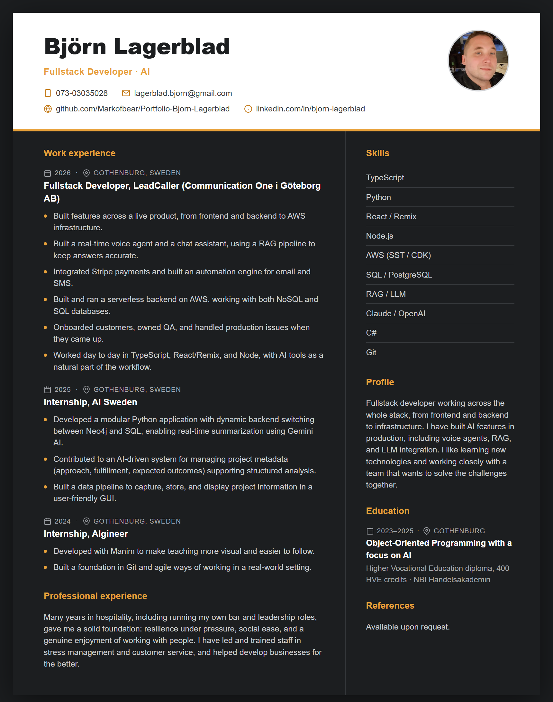
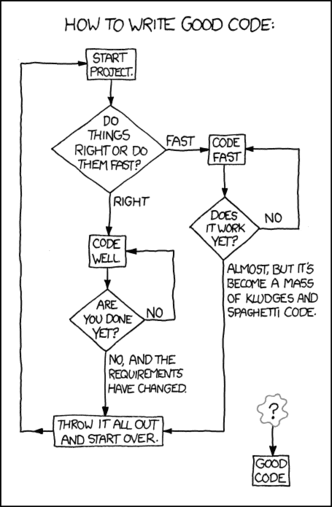

<h2 id="back-to-top">

# Hi there, I'm Björn 👋

### Fullstack Developer · AI

<h2 id="connect">🤝 Connect with me</h2>

- [: LinkedIn][linkedin]
- [GitHub: @Markofbear](https://github.com/Markofbear)

[linkedin]: https://www.linkedin.com/in/bjorn-lagerblad

---

* [Go to About me](#about-me)

* [Go to Experience](#experience)

* [Go to Resume](#Resume)

* [Go to Technical skills](#skills)

* [Go to Earlier projects](#projects)

* [Go to Courses](#Courses)

* [Go to Contact me](#contact-me)

---
<h2 id="about-me">🧑‍💼 About me</h2>

I'm a fullstack developer who builds and ships software end to end, frontend, backend, and AWS infrastructure. At **LeadCaller** I work across a live product where I've built a real-time voice agent and a chat assistant backed by a RAG pipeline, integrated Stripe payments, and built an automation engine for email and SMS on a serverless AWS backend.

Before tech I spent years in hospitality, including running my own bar. That taught me to stay calm under pressure, solve problems on the fly, and work well with people. I bring the same instincts to development.

I work day to day in TypeScript, React/Remix, and Node, with AI tools as a natural part of the workflow. I like learning new technologies and working closely with a team that wants to solve the challenges together.

---
<h2 id="experience">⭐ Experience</h2>

### Fullstack Developer — LeadCaller (Communication One i Göteborg AB) · 2026

- Built features across a live product, from frontend and backend to AWS infrastructure.
- Built a real-time voice agent and a chat assistant, using a RAG pipeline to keep answers accurate.
- Integrated Stripe payments and built an automation engine for email and SMS.
- Built and ran a serverless backend on AWS, working with both NoSQL and SQL databases.
- Onboarded customers, owned QA, and handled production issues.
- Worked day to day in TypeScript, React/Remix, and Node, with AI tools as a natural part of the workflow.

Stack: TypeScript · Remix / React · Node · AWS serverless (SST / CDK) · DynamoDB · PostgreSQL · Redis · Qdrant / Pinecone.

### Internship — AI Sweden · 2025

- Built a modular Python application with dynamic backend switching between Neo4j and SQL, with real-time summarization using Gemini.
- Contributed to an AI-driven system for managing project metadata to support structured analysis.
- Built a data pipeline to capture, store, and display project information in a user-friendly GUI.

### Internship — AIgineer · 2024

- Developed teaching visuals with Manim to make concepts easier to follow.
- Built a foundation in Git and agile ways of working in a real-world setting.

* [Back to top](#back-to-top)

---
<h2 id="Resume">📓 Resume</h2>

📄 **[Download CV (PDF)](assets/BjornLagerbladCV.pdf)**

* [Back to top](#back-to-top)

---
<h2 id="skills">🧑‍💻 Technical skills</h2>

**Core stack**

**Also worked with (data science / ML)**

* [Back to top](#back-to-top)

---
<h2 id="projects">💼 Earlier projects</h2>

Click on the links to view the corresponding GitHub repositories.

| Repository | Description |
| --- | --- |
| [Podcast Generator][podcast]|Full-stack AI project that transforms Wikipedia articles, PDFs, and text files into radio-style podcast dialogues with dynamic discussions and contextual deep-dives. Built with Python (PySide6, Gemini API, multi-TTS pipeline) and supports auto-generated background music that adapts to the topic’s tone. Recently added support for YouTube Closed Captions. [Demo video on LinkedIn](https://www.linkedin.com/posts/bjorn-lagerblad_opentowork-opentowork-python-activity-7328735576239603713-BCtP?utm_source=social_share_send&utm_medium=member_desktop_web&rcm=ACoAAAw8ppQBlF2AWJEGk7GuBtXNCKCC6DNZEBo). |
| [Thesis][thesis] | Deep dive into Python automation and fullstack.  |
| [Fullstack][fullstack] | Full-stack app with Streamlit and database integration |
| [Manim][manim] | Manim animations, working with Bézier curves and design |

[manim]: https://github.com/Markofbear/ManimTraining
[fullstack]: https://bjornyoutubedata.streamlit.app/
[thesis]: https://github.com/Markofbear/Degree_project
[podcast]: https://github.com/Markofbear/Podcast-Generator

* [Back to top](#back-to-top)

---

<h2 id="roles">🔭 Roles I'm specialized towards</h2>

| **Fullstack & Backend**     | **AI & Automation**          | **Data (secondary)**           |
|-----------------------------|------------------------------|--------------------------------|
| Fullstack Developer         | AI Developer / AI Engineer   | Data Scientist                 |
| Backend Developer           | Voice / Conversational AI    | Data Engineer                  |
| Software Engineer           | RAG & LLM Integration        | Data Analyst                   |
| Node + TypeScript Developer | Automation Engineer          | Machine Learning Engineer      |
| C# Developer                | DevOps / Cloud (AWS)         | Business Analyst               |

* [Back to top](#back-to-top)

---
<h2 id="Courses">🎓 Courses @ NBI / Handelsakademin OOP23</h2>

<table>
    <thead>
        <th>Courses</th>
        <th>Language</th>
    </thead>
    <tr>
        <td>Introduction to Object-oriented programming</td>
        <td></td>
    </tr>
    <tr>
        <td>Object-oriented programming basics</td>
        <td></td>
    </tr>
    <tr>
        <td>Agile Project Management</td>
        <td>
            
            
        </td>
    </tr>
    <tr>
        <td>Databases</td>
        <td></td>
    </tr>
    <tr>
        <td>Artificial intelligence 1</td>
        <td></td>
    </tr>
    <tr>
        <td>Artificial intelligence 2</td>
        <td>
        </td>
    </tr>
    <tr>
        <td>Object-oriented programming advanced 1</td>
        <td>
            
            
        </td>
    </tr>
    <tr>
        <td>Internship 1 @AIgineer</td>
        <td></td>
    </tr>
    <tr>
        <td>Object-oriented programming advanced 2</td>
        <td></td>
    </tr>
    <tr>
        <td>Thesis</td>
        <td></td>
    </tr>
    <tr>
        <td>Internship 2 @ AI Sweden</td>
        <td>
        
                
        </td>    </tr>
</table>

* [Back to top](#back-to-top)

---
<h2 id="contact-me">🤝 Connect with me</h2>

- [: LinkedIn][linkedin]
- [GitHub: @Markofbear](https://github.com/Markofbear)

* [Back to top](#back-to-top)

