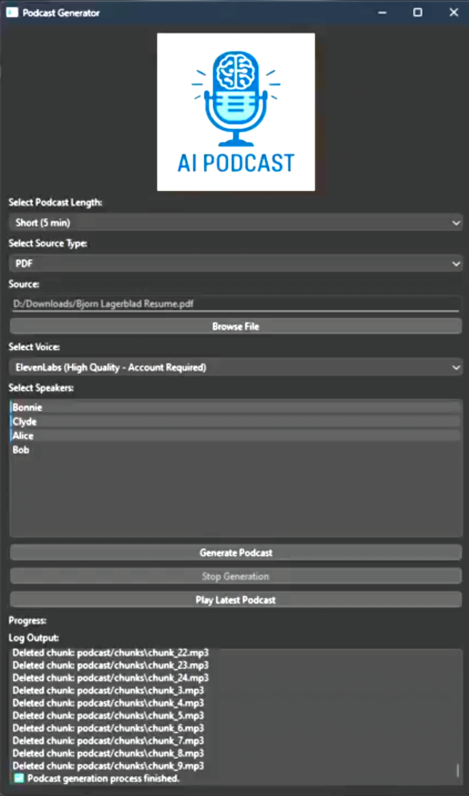

# Hi there, I'm Björn 👋
### Fullstack Developer · AI

I build and ship production software end to end, including real-time voice AI and RAG pipelines.

[-1c1e20?style=for-the-badge)](assets/BjornLagerbladCV.pdf)

**[About](#about-me) · [Experience](#experience) · [Projects](#projects) · [Skills](#skills) · [Resume](#Resume) · [Contact](#contact-me)**

---

<h2 id="about-me">🧑‍💼 About me</h2>

I'm a fullstack developer who builds and ships software end to end, from the frontend to the backend. In my most recent role, most of my work has been on the AI side, voice agents and chat assistants backed by RAG pipelines. I work in both TypeScript and Python, and I like learning new tools.

Before I worked in tech, I spent years in hospitality. I came up through restaurants and bars, was given more responsibility and grew into the role until I was running a large part of a chain and training staff in customer service, stress management, and communication. I also started my own bar. It's where I learned most of what I know about people. I'm sociable, full of energy for the people I work with, and never far from a laugh. I know how much people gain from open communication and being able to have fun together.

---
<h2 id="experience">⭐ Experience</h2>

### Fullstack Developer, LeadCaller (Communication One i Göteborg AB) · 2026

- Delivered customer-facing features end to end on a live SaaS product, from the React/Remix UI down to serverless AWS (Lambda, DynamoDB, API Gateway), used daily by the sales team and customers.
- Built a voice agent integrated with Twilio, using Deepgram for speech-to-text, OpenAI for reasoning, and ElevenLabs for natural speech.
- Paired that with a RAG chat assistant that answers from each customer's own data, using embeddings and vector search (Qdrant, Pinecone) to keep answers grounded rather than guessed at.
- Shipped dashboards with live statistics that became the team's analysis and sales tool, built in React/Remix and updated live over WebSockets.
- Integrated Stripe payments (checkout and webhooks) and built an engine that sends customer email and SMS automatically, running serverless on AWS across PostgreSQL and DynamoDB.
- Onboarded new customers, owned QA, and debugged production issues on a live system.

Stack: TypeScript · Remix / React · Node · AWS serverless (SST / CDK) · DynamoDB · PostgreSQL · Redis · Qdrant / Pinecone.

### Internship, AI Sweden · 2025

- Created an internal tool that pulled project reports from Neo4j and SQL, summarized them with Gemini, and wrote the summaries back, so the team could see where each project stood at a glance instead of reading full reports.
- Designed and built the interface: view, edit and manage all project reports in one place.

### Internship, AIgineer · 2024

- Built teaching animations in Manim (Bézier curves, motion design) in my first professional dev team, working with Git and an agile workflow.

[↑ Back to top](#back-to-top)

---
<h2 id="projects">💼 Projects</h2>

### 🎙️ Podcast Generator

> Turn any Wikipedia article, PDF, YouTube video, or text file into a multi-speaker, AI-narrated podcast.

A full-stack AI desktop app (Python · PySide6) that extracts a source, has **Gemini** write multi-speaker dialogue, lets you **review and edit the script**, then voices it with swappable TTS (OpenAI · ElevenLabs · Google) and mixes in background music, all on a responsive, threaded GUI.

**[▶ Watch the demo](https://www.linkedin.com/posts/bjorn-lagerblad_opentowork-opentowork-python-activity-7328735576239603713-BCtP)** · **[View code](https://github.com/Markofbear/Podcast-Generator)**

**More projects**

| Project | What it is | |
| --- | --- | --- |
| **[YouTube Data App][fullstack]** | Live Streamlit app with database-backed YouTube analytics | [🔗 Live][fullstack] |
| **[Degree project][thesis]** | Python file-sorting automation tool, with in-depth written thesis documentation | [Code][thesis] |
| **[Manim Animations][manim]** | Teaching animations with Bézier curves & design | [Code][manim] |

[manim]: https://github.com/Markofbear/ManimTraining
[fullstack]: https://bjornyoutubedata.streamlit.app/
[thesis]: https://github.com/Markofbear/Degree_project

[↑ Back to top](#back-to-top)

---
<h2 id="skills">🧑‍💻 Technical skills</h2>

**Core stack**

![AWS](https://img.shields.io/badge/AWS-232F3E?style=for-the-badge&logo=data%3Aimage%2Fsvg%2Bxml%3Bbase64%2CPHN2ZyBmaWxsPSIjZmZmZmZmIiB4bWxucz0iaHR0cDovL3d3dy53My5vcmcvMjAwMC9zdmciIHdpZHRoPSIxZW0iIGhlaWdodD0iMWVtIiB2aWV3Qm94PSIwIDAgMjQgMjQiPjxwYXRoIGZpbGw9IiNmZmZmZmYiIGQ9Ik02Ljc2MyAxMC4wMzZxLjAwMi40NDYuMDg4LjcxYy4wNjQuMTc2LjE0NC4zNjguMjU2LjU3NmMuMDQuMDYzLjA1Ni4xMjcuMDU2LjE4M3EuMDAyLjEyLS4xNTIuMjRsLS41MDMuMzM1YS40LjQgMCAwIDEtLjIwOC4wNzJxLS4xMi0uMDAyLS4yMzktLjExMmEyLjUgMi41IDAgMCAxLS4yODctLjM3NWE2IDYgMCAwIDEtLjI0OC0uNDcxcS0uOTM0IDEuMTAxLTIuMzQ3IDEuMTAxYy0uNjcgMC0xLjIwNS0uMTkxLTEuNTk2LS41NzRxLS41ODgtLjU3NS0uNTktMS41MzNjMC0uNjc4LjIzOS0xLjIzLjcyNi0xLjY0NGMuNDg3LS40MTUgMS4xMzMtLjYyMyAxLjk1NS0uNjIzYy4yNzIgMCAuNTUxLjAyNC44NDYuMDY0Yy4yOTYuMDQuNi4xMDQuOTE4LjE3NnYtLjU4M3EtLjAwMS0uOTA5LS4zNzUtMS4yNzdjLS4yNTUtLjI0OC0uNjg2LS4zNjctMS4zLS4zNjdjLS4yOCAwLS41NjguMDMxLS44NjMuMTAzcS0uNDQzLjEwNi0uODYyLjI3MmEyIDIgMCAwIDEtLjI4LjEwNGEuNS41IDAgMCAxLS4xMjcuMDIzcS0uMTY4LjAwMi0uMTY4LS4yNDd2LS4zOTFjMC0uMTI4LjAxNi0uMjI0LjA1Ni0uMjhhLjYuNiAwIDAgMSAuMjI0LS4xNjdhNC42IDQuNiAwIDAgMSAxLjAwNS0uMzZhNC44IDQuOCAwIDAgMSAxLjI0Ni0uMTUxYy45NSAwIDEuNjQ0LjIxNiAyLjA5MS42NDdxLjY2LjY0NS42NjIgMS45NjN2Mi41ODZ6bS0zLjI0IDEuMjE0Yy4yNjMgMCAuNTM0LS4wNDguODIyLS4xNDRhMS44IDEuOCAwIDAgMCAuNzU4LS41MWExLjMgMS4zIDAgMCAwIC4yNzItLjUxMmMuMDQ3LS4xOTEuMDgtLjQyMy4wOC0uNjk0di0uMzM1YTcgNyAwIDAgMC0uNzM1LS4xMzZhNiA2IDAgMCAwLS43NS0uMDQ4Yy0uNTM1IDAtLjkyNi4xMDQtMS4xOS4zMmMtLjI2My4yMTUtLjM5LjUxOC0uMzkuOTE3YzAgLjM3NS4wOTUuNjU1LjI5NS44NDZjLjE5MS4yLjQ3LjI5Ni44MzguMjk2bTYuNDEuODYyYy0uMTQ0IDAtLjI0LS4wMjQtLjMwNC0uMDhjLS4wNjQtLjA0OC0uMTItLjE2LS4xNjgtLjMxMUw3LjU4NiA1LjU1YTEuNCAxLjQgMCAwIDEtLjA3Mi0uMzJjMC0uMTI4LjA2NC0uMi4xOTEtLjJoLjc4M3EuMjI3LS4wMDEuMzEuMDhjLjA2NS4wNDguMTEzLjE2LjE2LjMxMmwxLjM0MiA1LjI4NGwxLjI0NS01LjI4NHEuMDU4LS4yNC4xNTEtLjMxMmEuNTUuNTUgMCAwIDEgLjMyLS4wOGguNjM4Yy4xNTIgMCAuMjU2LjAyNS4zMi4wOGMuMDYzLjA0OC4xMi4xNi4xNTEuMzEybDEuMjYxIDUuMzQ4bDEuMzgxLTUuMzQ4cS4wNzQtLjI0LjE2LS4zMTJhLjUyLjUyIDAgMCAxIC4zMTEtLjA4aC43NDNjLjEyNyAwIC4yLjA2NS4yLjJjMCAuMDQtLjAwOS4wOC0uMDE3LjEyOGExIDEgMCAwIDEtLjA1Ni4ybC0xLjkyMyA2LjE3cS0uMDcyLjI0LS4xNjguMzExYS41LjUgMCAwIDEtLjMwMy4wOGgtLjY4N2MtLjE1MSAwLS4yNTUtLjAyNC0uMzItLjA4Yy0uMDYzLS4wNTYtLjExOS0uMTYtLjE1LS4zMmwtMS4yMzgtNS4xNDhsLTEuMjMgNS4xNGMtLjA0LjE2LS4wODcuMjY0LS4xNS4zMmMtLjA2NS4wNTYtLjE3Ny4wOC0uMzIuMDh6bTEwLjI1Ni4yMTVjLS40MTUgMC0uODMtLjA0OC0xLjIyOS0uMTQzYy0uMzk5LS4wOTYtLjcxLS4yLS45MTgtLjMyYy0uMTI4LS4wNzEtLjIxNS0uMTUxLS4yNDctLjIyM2EuNi42IDAgMCAxLS4wNDgtLjIyNHYtLjQwN2MwLS4xNjcuMDY0LS4yNDcuMTgzLS4yNDdxLjA3MiAwIC4xNDQuMDI0Yy4wNDguMDE2LjEyLjA0OC4yLjA4cS40MDguMTgxLjg3OC4yNzljLjMxOS4wNjQuNjMuMDk2Ljk1LjA5NmMuNTAyIDAgLjg5NC0uMDg4IDEuMTY1LS4yNjRhLjg2Ljg2IDAgMCAwIC40MTUtLjc1OGEuNzguNzggMCAwIDAtLjIxNS0uNTU5Yy0uMTQ0LS4xNTEtLjQxNi0uMjg3LS44MDctLjQxNWwtMS4xNTctLjM2Yy0uNTgzLS4xODMtMS4wMTQtLjQ1NC0xLjI3Ny0uODEzYTEuOSAxLjkgMCAwIDEtLjQtMS4xNThxMC0uNTAyLjIxNi0uODg2Yy4xNDQtLjI1NS4zMzUtLjQ3OS41NzUtLjY1NGMuMjQtLjE4NC41MS0uMzIuODMtLjQxNWMuMzItLjA5Ni42NTUtLjEzNiAxLjAwNi0uMTM2Yy4xNzUgMCAuMzU5LjAwOC41MzUuMDMyYy4xODMuMDI0LjM1LjA1Ni41MTguMDg4cS4yNC4wNTguNDU1LjEyN3EuMjE2LjA3Mi4zMzYuMTQ0YS43LjcgMCAwIDEgLjI0LjJhLjQzLjQzIDAgMCAxIC4wNzEuMjYzdi4zNzVxLS4wMDIuMjU0LS4xODQuMjU2YS44LjggMCAwIDEtLjMwMy0uMDk2YTMuNjUgMy42NSAwIDAgMC0xLjUzMi0uMzExYy0uNDU1IDAtLjgxNS4wNzEtMS4wNjIuMjIzcy0uMzc1LjM4My0uMzc1LjcxYzAgLjIyNC4wOC40MTYuMjQuNTY3Yy4xNTkuMTUyLjQ1NC4zMDQuODc3LjQ0bDEuMTM0LjM1OGMuNTc0LjE4NC45OS40NCAxLjIzNy43NjdzLjM2Ny43MDIuMzY3IDEuMTE3YzAgLjM0My0uMDcyLjY1NS0uMjA3LjkyNmEyLjIgMi4yIDAgMCAxLS41ODMuNzAzYy0uMjQ4LjItLjU0My4zNDMtLjg4Ni40NDdjLS4zNi4xMTEtLjczNC4xNjctMS4xNDIuMTY3bTEuNTA5IDMuODhjLTIuNjI2IDEuOTQtNi40NDIgMi45NjktOS43MjIgMi45NjljLTQuNTk4IDAtOC43NC0xLjctMTEuODctNC41MjZjLS4yNDctLjIyMy0uMDI0LS41MjcuMjcyLS4zNTFjMy4zODQgMS45NjMgNy41NTkgMy4xNTMgMTEuODc3IDMuMTUzYzIuOTE0IDAgNi4xMTQtLjYwNyA5LjA2LTEuODUyYy40MzktLjIuODE0LjI4Ny4zODMuNjA3bTEuMDk0LTEuMjQ2Yy0uMzM2LS40My0yLjIyLS4yMDctMy4wNzQtLjEwM2MtLjI1NS4wMzItLjI5NS0uMTkyLS4wNjMtLjM2YzEuNS0xLjA1MyAzLjk2Ny0uNzUgNC4yNTQtLjM5OWMuMjg3LjM2LS4wOCAyLjgyNi0xLjQ4NSA0LjAwN2MtLjIxNS4xODQtLjQyMy4wODgtLjMyNy0uMTUxYy4zMi0uNzkgMS4wMy0yLjU3LjY5NS0yLjk5NCIvPjwvc3ZnPg%3D%3D)
![DynamoDB](https://img.shields.io/badge/DynamoDB-4053D6?style=for-the-badge&logo=data%3Aimage%2Fsvg%2Bxml%3Bbase64%2CPHN2ZyBmaWxsPSIjZmZmZmZmIiB4bWxucz0iaHR0cDovL3d3dy53My5vcmcvMjAwMC9zdmciIHdpZHRoPSIxZW0iIGhlaWdodD0iMWVtIiB2aWV3Qm94PSIwIDAgMjQgMjQiPjxwYXRoIGZpbGw9IiNmZmZmZmYiIGQ9Ik0xNi42MDYgMjAuNzA1di0yLjM3MWMtMS4yNjMgMS4wODItMy44ODQgMS43OTUtNy4wNjYgMS43OTVjLTMuMTg0IDAtNS44MDUtLjcxNC03LjA2OC0xLjc5N3YyLjM2OWMwIDEuMTY4IDIuOTAzIDIuNDcgNy4wNjggMi40N2M0LjE2IDAgNy4wNi0xLjMgNy4wNjYtMi40NjZtLjAwMS02Ljc2NWwuODE3LS4wMDV2LjAwNWMwIC41MTctLjI1OC45OTgtLjc1IDEuNDQxYy42MDEuNTQuNzUgMS4wNzEuNzUgMS40NDlhMTY2MiAxNjYyIDAgMCAwIDAgMy44N2MwIDEuODgxLTMuMzg5IDMuMy03Ljg4NCAzLjNjLTQuNDcxIDAtNy44NDYtMS40MDQtNy44OC0zLjI3YTU4MyA1ODMgMCAwIDEtLjAwMy0zLjkwOWMuMDAxLS4zNzUuMTUtLjkuNzQ1LTEuNDM3Yy0uNTkyLS41MzgtLjc0My0xLjA2Mi0uNzQ2LTEuNDM1di0zLjg5MmMuMDAyLS4zNzcuMTUzLS45MDMuNzQ3LTEuNDM4Yy0uNTkzLS41NC0uNzQ0LTEuMDYyLS43NDctMS40MzVjMC0xLjM1Ny0uMDAyLTIuNzM1LjAwMi0zLjg5N0MxLjY3NCAxLjQxMiA1LjA1NiAwIDkuNTQgMGMyLjE1OSAwIDQuMjMzLjM1NiA1LjY4OS45NzRsLS4zMTUuNzY2Yy0xLjM2LS41OC0zLjMxOS0uOTEtNS4zNzQtLjkxYy00LjE2NSAwLTcuMDY3IDEuMy03LjA2NyAyLjQ3YzAgMS4xNjggMi45MDIgMi40NyA3LjA2NyAyLjQ3Yy4xMTUgMCAuMjIyIDAgLjMzNC0uMDA1bC4wMzMuODI4cS0uMTgzLjAwOC0uMzY3LjAwNmMtMy4xODQgMC01LjgwNS0uNzE0LTcuMDY4LTEuNzk4djIuMzhjLjAwNS40NS40NS44NDMuODIxIDEuMDkzYzEuMTE2LjczNiAzLjExNCAxLjIzOSA1LjM0IDEuMzQybC0uMDM3LjgyOWMtMi4yNTQtLjEwNS00LjIzLS41OS01LjUtMS4zMzJjLS4zMTguMjQ1LS42MjMuNTczLS42MjMuOTUyYzAgMS4xNjggMi45MDIgMi40NyA3LjA2NyAyLjQ3cS42MTYgMCAxLjIwMy0uMDQybC4wNi44MjZxLS42MTcuMDQ1LTEuMjYzLjA0NWMtMy4xODQgMC01LjgwNS0uNzEzLTcuMDY4LTEuNzk3djIuMzY4Yy4wMDUuNDYyLjQ0OS44NTUuODIxIDEuMTA0YzEuMjc1Ljg0MiAzLjY3IDEuMzY2IDYuMjQ3IDEuMzY2aC4xODJ2LjgzSDkuNTRjLTIuNjIgMC00Ljk5LS41MDctNi40NDQtMS4zNTljLS4zMTcuMjQ1LS42MjMuNTc0LS42MjMuOTU0YzAgMS4xNjggMi45MDIgMi40NyA3LjA2NyAyLjQ3YzQuMTU5IDAgNy4wNTgtMS4yOTggNy4wNjYtMi40NjV2LS4wMDdjMC0uMzc3LS4zMDMtLjcwNS0uNjItLjk0OGE2IDYgMCAwIDEtLjY2Mi4zMzZsLS4zMTYtLjc2NHEuNDUxLS4xOTIuNzc2LS40MTJjLjM3Ni0uMjU0LjgyMy0uNjUxLjgyMy0xLjFtNC4zNzctNi45MTVoLTIuNzE3YS40LjQgMCAwIDEtLjMzMi0uMTczYS40Mi40MiAwIDAgMS0uMDU1LS4zNzVsMS4yMDQtMy41OTdoLTUuNDAzbC0yLjU4MyA0Ljk3NGgyLjYyM2MuMTI4IDAgLjI0OC4wNi4zMjUuMTY0YS40Mi40MiAwIDAgMSAuMDY5LjM2bC0yLjI0OSA4LjM2NXptMS4yNDktLjEyOGwtMTAuODkgMTEuNjA4YS40MS40MSAwIDAgMS0uNDk4LjA3NWEuNDIuNDIgMCAwIDEtLjE5Mi0uNDcxbDIuNTM0LTkuNDI2aC0yLjc2NmEuNDEuNDEgMCAwIDEtLjM0OS0uMmEuNDIuNDIgMCAwIDEtLjAxMi0uNDA3bDMuMDE0LTUuODA0YS40MS40MSAwIDAgMSAuMzYtLjIyMmg2LjIyYy4xMzIgMCAuMjU2LjA2NS4zMzIuMTc0YS40Mi40MiAwIDAgMSAuMDU1LjM3NGwtMS4yMDQgMy41OThoMy4xYy4xNjQgMCAuMzEuMDk5LjM3NS4yNTFhLjQyLjQyIDAgMCAxLS4wOC40NXpNMy4wODUgMjAuNzIzYTggOCAwIDAgMCAxLjcyLjcybC4yMzMtLjc5NGE3LjMgNy4zIDAgMCAxLTEuNTQ2LS42NDV6bTEuNzItNS45ODRsLjIzMy0uNzk1YTcuMyA3LjMgMCAwIDEtMS41NDYtLjY0NmwtLjQwNy43MmE4IDggMCAwIDAgMS43Mi43MnptLTEuNzItNy40MjdsLjQwNy0uNzE5Yy40MTguMjQ0LjkzOS40NjIgMS41NDYuNjQ2bC0uMjMyLjc5NGE4IDggMCAwIDEtMS43Mi0uNzJaIi8%2BPC9zdmc%2B)

**AI**

![OpenAI](https://img.shields.io/badge/OpenAI-412991?style=for-the-badge&logo=data%3Aimage%2Fsvg%2Bxml%3Bbase64%2CPHN2ZyBmaWxsPSIjZmZmZmZmIiB4bWxucz0iaHR0cDovL3d3dy53My5vcmcvMjAwMC9zdmciIHdpZHRoPSIxZW0iIGhlaWdodD0iMWVtIiB2aWV3Qm94PSIwIDAgMjQgMjQiPjxwYXRoIGZpbGw9IiNmZmZmZmYiIGQ9Ik0yMi4yODIgOS44MjFhNiA2IDAgMCAwLS41MTYtNC45MWE2LjA1IDYuMDUgMCAwIDAtNi41MS0yLjlBNi4wNjUgNi4wNjUgMCAwIDAgNC45ODEgNC4xOGE2IDYgMCAwIDAtMy45OTggMi45YTYuMDUgNi4wNSAwIDAgMCAuNzQzIDcuMDk3YTUuOTggNS45OCAwIDAgMCAuNTEgNC45MTFhNi4wNSA2LjA1IDAgMCAwIDYuNTE1IDIuOUE2IDYgMCAwIDAgMTMuMjYgMjRhNi4wNiA2LjA2IDAgMCAwIDUuNzcyLTQuMjA2YTYgNiAwIDAgMCAzLjk5Ny0yLjlhNi4wNiA2LjA2IDAgMCAwLS43NDctNy4wNzNNMTMuMjYgMjIuNDNhNC40OCA0LjQ4IDAgMCAxLTIuODc2LTEuMDRsLjE0MS0uMDgxbDQuNzc5LTIuNzU4YS44LjggMCAwIDAgLjM5Mi0uNjgxdi02LjczN2wyLjAyIDEuMTY4YS4wNy4wNyAwIDAgMSAuMDM4LjA1MnY1LjU4M2E0LjUwNCA0LjUwNCAwIDAgMS00LjQ5NCA0LjQ5NE0zLjYgMTguMzA0YTQuNDcgNC40NyAwIDAgMS0uNTM1LTMuMDE0bC4xNDIuMDg1bDQuNzgzIDIuNzU5YS43Ny43NyAwIDAgMCAuNzggMGw1Ljg0My0zLjM2OXYyLjMzMmEuMDguMDggMCAwIDEtLjAzMy4wNjJMOS43NCAxOS45NWE0LjUgNC41IDAgMCAxLTYuMTQtMS42NDZNMi4zNCA3Ljg5NmE0LjUgNC41IDAgMCAxIDIuMzY2LTEuOTczVjExLjZhLjc3Ljc3IDAgMCAwIC4zODguNjc3bDUuODE1IDMuMzU0bC0yLjAyIDEuMTY4YS4wOC4wOCAwIDAgMS0uMDcxIDBsLTQuODMtMi43ODZBNC41MDQgNC41MDQgMCAwIDEgMi4zNCA3Ljg3MnptMTYuNTk3IDMuODU1bC01LjgzMy0zLjM4N0wxNS4xMTkgNy4yYS4wOC4wOCAwIDAgMSAuMDcxIDBsNC44MyAyLjc5MWE0LjQ5NCA0LjQ5NCAwIDAgMS0uNjc2IDguMTA1di01LjY3OGEuNzkuNzkgMCAwIDAtLjQwNy0uNjY3bTIuMDEtMy4wMjNsLS4xNDEtLjA4NWwtNC43NzQtMi43ODJhLjc4Ljc4IDAgMCAwLS43ODUgMEw5LjQwOSA5LjIzVjYuODk3YS4wNy4wNyAwIDAgMSAuMDI4LS4wNjFsNC44My0yLjc4N2E0LjUgNC41IDAgMCAxIDYuNjggNC42NnptLTEyLjY0IDQuMTM1bC0yLjAyLTEuMTY0YS4wOC4wOCAwIDAgMS0uMDM4LS4wNTdWNi4wNzVhNC41IDQuNSAwIDAgMSA3LjM3NS0zLjQ1M2wtLjE0Mi4wOEw4LjcwNCA1LjQ2YS44LjggMCAwIDAtLjM5My42ODF6bTEuMDk3LTIuMzY1bDIuNjAyLTEuNWwyLjYwNyAxLjV2Mi45OTlsLTIuNTk3IDEuNWwtMi42MDctMS41WiIvPjwvc3ZnPg%3D%3D)

**Also worked with**

![C#](https://img.shields.io/badge/C%23-239120?style=for-the-badge&logo=data%3Aimage%2Fsvg%2Bxml%3Bbase64%2CPHN2ZyBmaWxsPSIjZmZmZmZmIiB4bWxucz0iaHR0cDovL3d3dy53My5vcmcvMjAwMC9zdmciIHdpZHRoPSIxZW0iIGhlaWdodD0iMWVtIiB2aWV3Qm94PSIwIDAgMjQgMjQiPjxwYXRoIGZpbGw9IiNmZmZmZmYiIGQ9Ik0xLjE5NCA3LjU0M3Y4LjkxM2MwIDEuMTAzLjU4OCAyLjEyMiAxLjU0NCAyLjY3NGw3LjcxOCA0LjQ1NmEzLjA5IDMuMDkgMCAwIDAgMy4wODggMGw3LjcxOC00LjQ1NmEzLjA5IDMuMDkgMCAwIDAgMS41NDQtMi42NzRWNy41NDNhMy4wOCAzLjA4IDAgMCAwLTEuNTQ0LTIuNjczTDEzLjU0NC40MTRhMy4wOSAzLjA5IDAgMCAwLTMuMDg4IDBMMi43MzggNC44N2EzLjA5IDMuMDkgMCAwIDAtMS41NDQgMi42NzNtNS40MDMgMi45MTR2My4wODdhLjc3Ljc3IDAgMCAwIC43NzIuNzcyYS43NzMuNzczIDAgMCAwIC43NzItLjc3MmEuNzczLjc3MyAwIDAgMSAxLjMxNy0uNTQ2YS43OC43OCAwIDAgMSAuMjI2LjU0NmEyLjMxNCAyLjMxNCAwIDEgMS00LjYzMSAwdi0zLjA4N2MwLS42MTUuMjQ0LTEuMjAzLjY3OS0xLjYzN2EyLjMxIDIuMzEgMCAwIDEgMy4yNzQgMGMuNDM0LjQzNC42NzggMS4wMjMuNjc4IDEuNjM3YS43Ny43NyAwIDAgMS0uMjI2LjU0NWEuNzY3Ljc2NyAwIDAgMS0xLjA5MSAwYS43Ny43NyAwIDAgMS0uMjI2LS41NDVhLjc3Ljc3IDAgMCAwLS43NzItLjc3MmEuNzcuNzcgMCAwIDAtLjc3Mi43NzJtMTIuMzUgMy4wODdhLjc3Ljc3IDAgMCAxLS43NzIuNzcyaC0uNzcydi43NzJhLjc3My43NzMgMCAwIDEtMS41NDQgMHYtLjc3MmgtMS41NDR2Ljc3MmEuNzczLjc3MyAwIDAgMS0xLjMxNy41NDZhLjc4Ljc4IDAgMCAxLS4yMjYtLjU0NnYtLjc3MkgxMmEuNzcxLjc3MSAwIDEgMSAwLTEuNTQ0aC43NzJ2LTEuNTQzSDEyYS43Ny43NyAwIDEgMSAwLTEuNTQ0aC43NzJ2LS43NzJhLjc3My43NzMgMCAwIDEgMS4zMTctLjU0NmEuNzguNzggMCAwIDEgLjIyNi41NDZ2Ljc3MmgxLjU0NHYtLjc3MmEuNzczLjc3MyAwIDAgMSAxLjU0NCAwdi43NzJoLjc3MmEuNzcyLjc3MiAwIDAgMSAwIDEuNTQ0aC0uNzcydjEuNTQzaC43NzJhLjc3Ni43NzYgMCAwIDEgLjc3Mi43NzJtLTMuMDg4LTIuMzE1aC0xLjU0NHYxLjU0M2gxLjU0NHoiLz48L3N2Zz4%3D)

[↑ Back to top](#back-to-top)

---
<h2 id="Resume">📓 Resume</h2>

📄 **[Download CV (PDF)](assets/BjornLagerbladCV.pdf)**

[↑ Back to top](#back-to-top)

---
<h2 id="education">🎓 Education</h2>

**Object-Oriented Programming with a focus on AI**, NBI Handelsakademin · 2023-2025
Higher Vocational Education diploma, 400 HVE credits.

📚 Course list

 

| Course | Focus |
| --- | --- |
| Introduction to Object-oriented programming | ![C#](https://img.shields.io/badge/C%23-239120?style=for-the-badge&logo=data%3Aimage%2Fsvg%2Bxml%3Bbase64%2CPHN2ZyBmaWxsPSIjZmZmZmZmIiB4bWxucz0iaHR0cDovL3d3dy53My5vcmcvMjAwMC9zdmciIHdpZHRoPSIxZW0iIGhlaWdodD0iMWVtIiB2aWV3Qm94PSIwIDAgMjQgMjQiPjxwYXRoIGZpbGw9IiNmZmZmZmYiIGQ9Ik0xLjE5NCA3LjU0M3Y4LjkxM2MwIDEuMTAzLjU4OCAyLjEyMiAxLjU0NCAyLjY3NGw3LjcxOCA0LjQ1NmEzLjA5IDMuMDkgMCAwIDAgMy4wODggMGw3LjcxOC00LjQ1NmEzLjA5IDMuMDkgMCAwIDAgMS41NDQtMi42NzRWNy41NDNhMy4wOCAzLjA4IDAgMCAwLTEuNTQ0LTIuNjczTDEzLjU0NC40MTRhMy4wOSAzLjA5IDAgMCAwLTMuMDg4IDBMMi43MzggNC44N2EzLjA5IDMuMDkgMCAwIDAtMS41NDQgMi42NzNtNS40MDMgMi45MTR2My4wODdhLjc3Ljc3IDAgMCAwIC43NzIuNzcyYS43NzMuNzczIDAgMCAwIC43NzItLjc3MmEuNzczLjc3MyAwIDAgMSAxLjMxNy0uNTQ2YS43OC43OCAwIDAgMSAuMjI2LjU0NmEyLjMxNCAyLjMxNCAwIDEgMS00LjYzMSAwdi0zLjA4N2MwLS42MTUuMjQ0LTEuMjAzLjY3OS0xLjYzN2EyLjMxIDIuMzEgMCAwIDEgMy4yNzQgMGMuNDM0LjQzNC42NzggMS4wMjMuNjc4IDEuNjM3YS43Ny43NyAwIDAgMS0uMjI2LjU0NWEuNzY3Ljc2NyAwIDAgMS0xLjA5MSAwYS43Ny43NyAwIDAgMS0uMjI2LS41NDVhLjc3Ljc3IDAgMCAwLS43NzItLjc3MmEuNzcuNzcgMCAwIDAtLjc3Mi43NzJtMTIuMzUgMy4wODdhLjc3Ljc3IDAgMCAxLS43NzIuNzcyaC0uNzcydi43NzJhLjc3My43NzMgMCAwIDEtMS41NDQgMHYtLjc3MmgtMS41NDR2Ljc3MmEuNzczLjc3MyAwIDAgMS0xLjMxNy41NDZhLjc4Ljc4IDAgMCAxLS4yMjYtLjU0NnYtLjc3MkgxMmEuNzcxLjc3MSAwIDEgMSAwLTEuNTQ0aC43NzJ2LTEuNTQzSDEyYS43Ny43NyAwIDEgMSAwLTEuNTQ0aC43NzJ2LS43NzJhLjc3My43NzMgMCAwIDEgMS4zMTctLjU0NmEuNzguNzggMCAwIDEgLjIyNi41NDZ2Ljc3MmgxLjU0NHYtLjc3MmEuNzczLjc3MyAwIDAgMSAxLjU0NCAwdi43NzJoLjc3MmEuNzcyLjc3MiAwIDAgMSAwIDEuNTQ0aC0uNzcydjEuNTQzaC43NzJhLjc3Ni43NzYgMCAwIDEgLjc3Mi43NzJtLTMuMDg4LTIuMzE1aC0xLjU0NHYxLjU0M2gxLjU0NHoiLz48L3N2Zz4%3D) |
| Object-oriented programming basics | ![C#](https://img.shields.io/badge/C%23-239120?style=for-the-badge&logo=data%3Aimage%2Fsvg%2Bxml%3Bbase64%2CPHN2ZyBmaWxsPSIjZmZmZmZmIiB4bWxucz0iaHR0cDovL3d3dy53My5vcmcvMjAwMC9zdmciIHdpZHRoPSIxZW0iIGhlaWdodD0iMWVtIiB2aWV3Qm94PSIwIDAgMjQgMjQiPjxwYXRoIGZpbGw9IiNmZmZmZmYiIGQ9Ik0xLjE5NCA3LjU0M3Y4LjkxM2MwIDEuMTAzLjU4OCAyLjEyMiAxLjU0NCAyLjY3NGw3LjcxOCA0LjQ1NmEzLjA5IDMuMDkgMCAwIDAgMy4wODggMGw3LjcxOC00LjQ1NmEzLjA5IDMuMDkgMCAwIDAgMS41NDQtMi42NzRWNy41NDNhMy4wOCAzLjA4IDAgMCAwLTEuNTQ0LTIuNjczTDEzLjU0NC40MTRhMy4wOSAzLjA5IDAgMCAwLTMuMDg4IDBMMi43MzggNC44N2EzLjA5IDMuMDkgMCAwIDAtMS41NDQgMi42NzNtNS40MDMgMi45MTR2My4wODdhLjc3Ljc3IDAgMCAwIC43NzIuNzcyYS43NzMuNzczIDAgMCAwIC43NzItLjc3MmEuNzczLjc3MyAwIDAgMSAxLjMxNy0uNTQ2YS43OC43OCAwIDAgMSAuMjI2LjU0NmEyLjMxNCAyLjMxNCAwIDEgMS00LjYzMSAwdi0zLjA4N2MwLS42MTUuMjQ0LTEuMjAzLjY3OS0xLjYzN2EyLjMxIDIuMzEgMCAwIDEgMy4yNzQgMGMuNDM0LjQzNC42NzggMS4wMjMuNjc4IDEuNjM3YS43Ny43NyAwIDAgMS0uMjI2LjU0NWEuNzY3Ljc2NyAwIDAgMS0xLjA5MSAwYS43Ny43NyAwIDAgMS0uMjI2LS41NDVhLjc3Ljc3IDAgMCAwLS43NzItLjc3MmEuNzcuNzcgMCAwIDAtLjc3Mi43NzJtMTIuMzUgMy4wODdhLjc3Ljc3IDAgMCAxLS43NzIuNzcyaC0uNzcydi43NzJhLjc3My43NzMgMCAwIDEtMS41NDQgMHYtLjc3MmgtMS41NDR2Ljc3MmEuNzczLjc3MyAwIDAgMS0xLjMxNy41NDZhLjc4Ljc4IDAgMCAxLS4yMjYtLjU0NnYtLjc3MkgxMmEuNzcxLjc3MSAwIDEgMSAwLTEuNTQ0aC43NzJ2LTEuNTQzSDEyYS43Ny43NyAwIDEgMSAwLTEuNTQ0aC43NzJ2LS43NzJhLjc3My43NzMgMCAwIDEgMS4zMTctLjU0NmEuNzguNzggMCAwIDEgLjIyNi41NDZ2Ljc3MmgxLjU0NHYtLjc3MmEuNzczLjc3MyAwIDAgMSAxLjU0NCAwdi43NzJoLjc3MmEuNzcyLjc3MiAwIDAgMSAwIDEuNTQ0aC0uNzcydjEuNTQzaC43NzJhLjc3Ni43NzYgMCAwIDEgLjc3Mi43NzJtLTMuMDg4LTIuMzE1aC0xLjU0NHYxLjU0M2gxLjU0NHoiLz48L3N2Zz4%3D) |
| Agile Project Management | ![C#](https://img.shields.io/badge/C%23-239120?style=for-the-badge&logo=data%3Aimage%2Fsvg%2Bxml%3Bbase64%2CPHN2ZyBmaWxsPSIjZmZmZmZmIiB4bWxucz0iaHR0cDovL3d3dy53My5vcmcvMjAwMC9zdmciIHdpZHRoPSIxZW0iIGhlaWdodD0iMWVtIiB2aWV3Qm94PSIwIDAgMjQgMjQiPjxwYXRoIGZpbGw9IiNmZmZmZmYiIGQ9Ik0xLjE5NCA3LjU0M3Y4LjkxM2MwIDEuMTAzLjU4OCAyLjEyMiAxLjU0NCAyLjY3NGw3LjcxOCA0LjQ1NmEzLjA5IDMuMDkgMCAwIDAgMy4wODggMGw3LjcxOC00LjQ1NmEzLjA5IDMuMDkgMCAwIDAgMS41NDQtMi42NzRWNy41NDNhMy4wOCAzLjA4IDAgMCAwLTEuNTQ0LTIuNjczTDEzLjU0NC40MTRhMy4wOSAzLjA5IDAgMCAwLTMuMDg4IDBMMi43MzggNC44N2EzLjA5IDMuMDkgMCAwIDAtMS41NDQgMi42NzNtNS40MDMgMi45MTR2My4wODdhLjc3Ljc3IDAgMCAwIC43NzIuNzcyYS43NzMuNzczIDAgMCAwIC43NzItLjc3MmEuNzczLjc3MyAwIDAgMSAxLjMxNy0uNTQ2YS43OC43OCAwIDAgMSAuMjI2LjU0NmEyLjMxNCAyLjMxNCAwIDEgMS00LjYzMSAwdi0zLjA4N2MwLS42MTUuMjQ0LTEuMjAzLjY3OS0xLjYzN2EyLjMxIDIuMzEgMCAwIDEgMy4yNzQgMGMuNDM0LjQzNC42NzggMS4wMjMuNjc4IDEuNjM3YS43Ny43NyAwIDAgMS0uMjI2LjU0NWEuNzY3Ljc2NyAwIDAgMS0xLjA5MSAwYS43Ny43NyAwIDAgMS0uMjI2LS41NDVhLjc3Ljc3IDAgMCAwLS43NzItLjc3MmEuNzcuNzcgMCAwIDAtLjc3Mi43NzJtMTIuMzUgMy4wODdhLjc3Ljc3IDAgMCAxLS43NzIuNzcyaC0uNzcydi43NzJhLjc3My43NzMgMCAwIDEtMS41NDQgMHYtLjc3MmgtMS41NDR2Ljc3MmEuNzczLjc3MyAwIDAgMS0xLjMxNy41NDZhLjc4Ljc4IDAgMCAxLS4yMjYtLjU0NnYtLjc3MkgxMmEuNzcxLjc3MSAwIDEgMSAwLTEuNTQ0aC43NzJ2LTEuNTQzSDEyYS43Ny43NyAwIDEgMSAwLTEuNTQ0aC43NzJ2LS43NzJhLjc3My43NzMgMCAwIDEgMS4zMTctLjU0NmEuNzguNzggMCAwIDEgLjIyNi41NDZ2Ljc3MmgxLjU0NHYtLjc3MmEuNzczLjc3MyAwIDAgMSAxLjU0NCAwdi43NzJoLjc3MmEuNzcyLjc3MiAwIDAgMSAwIDEuNTQ0aC0uNzcydjEuNTQzaC43NzJhLjc3Ni43NzYgMCAwIDEgLjc3Mi43NzJtLTMuMDg4LTIuMzE1aC0xLjU0NHYxLjU0M2gxLjU0NHoiLz48L3N2Zz4%3D)  |
| Databases |  |
| Artificial intelligence 1 |   |
| Artificial intelligence 2 |   |
| Object-oriented programming advanced 1 |   |
| Internship 1, AIgineer |  |
| Object-oriented programming advanced 2 |  |
| Thesis |  |
| Internship 2, AI Sweden |    |

[↑ Back to top](#back-to-top)

---
<h2 id="contact-me">🤝 Get in touch</h2>

[**LinkedIn**](https://www.linkedin.com/in/bjorn-lagerblad) · [**GitHub**](https://github.com/Markofbear) · [**Email**](mailto:lagerblad.bjorn@gmail.com) · Gothenburg, Sweden

  

